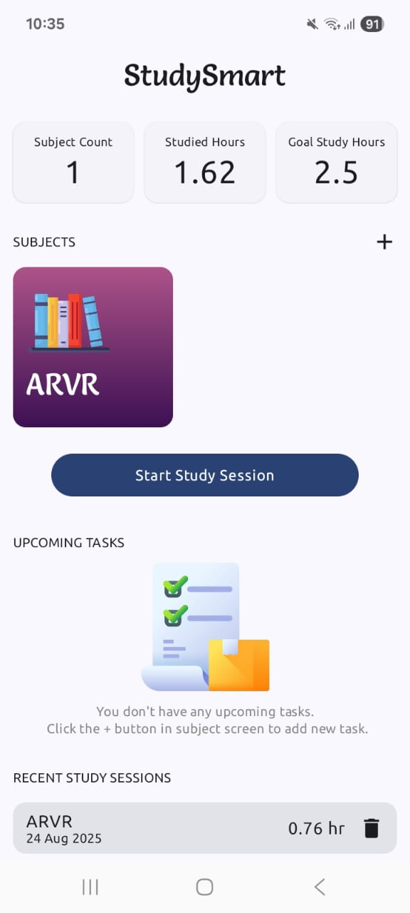
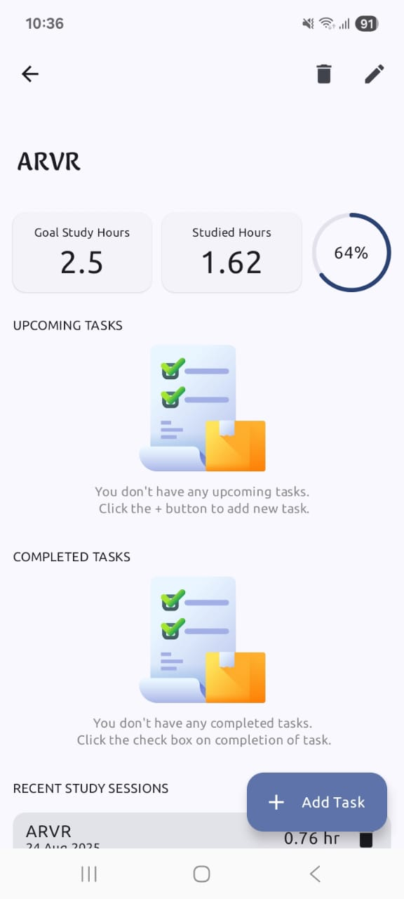
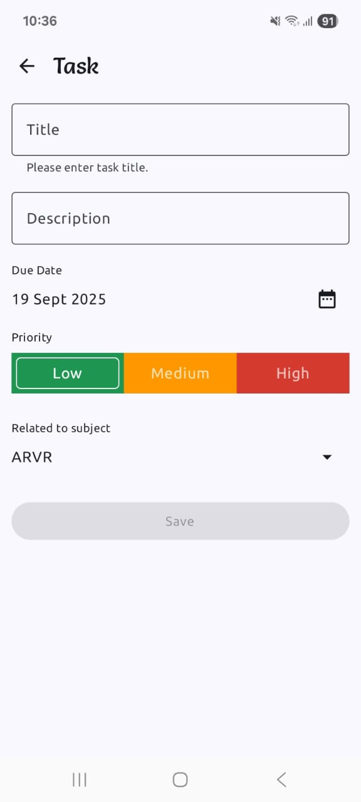
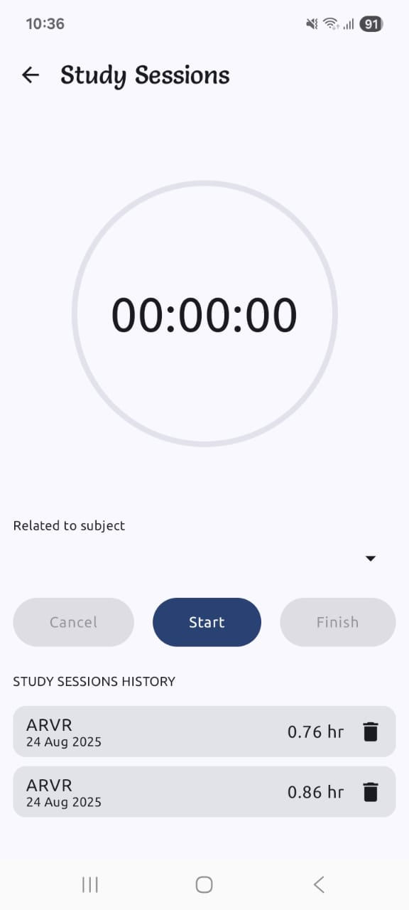
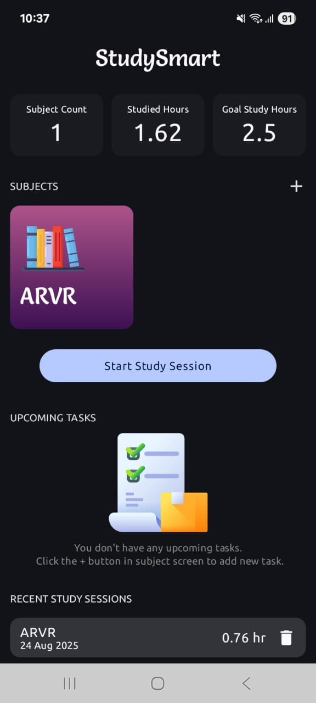
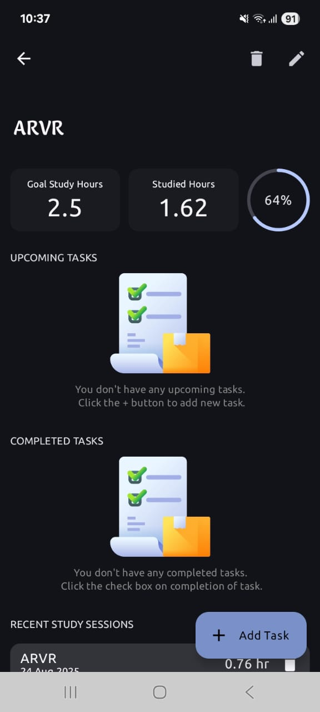
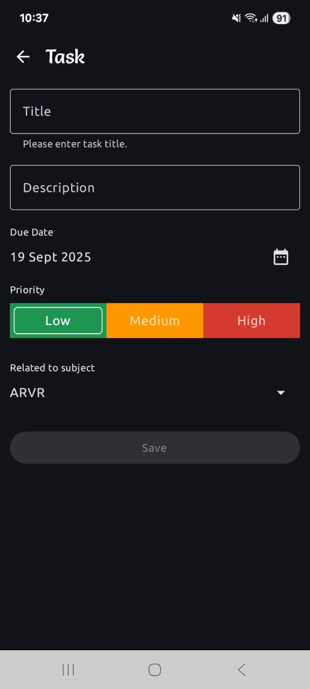
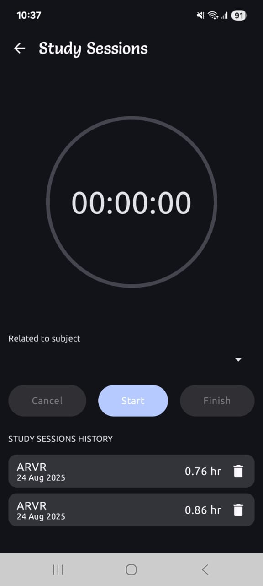

---

# 📚 StudySmartApp

**StudySmartApp** is an **offline-first Android app** built with Kotlin that helps students **track study hours, subjects, and tasks** with smart session timers and progress analytics.

---

## ✨ Features

* 📖 **Subject Management**

  * Add, edit, and delete subjects.
  * Assign a total number of hours to each subject.

* ✅ **Task Tracking**

  * Add and delete tasks for each subject.
  * Set **priority levels** for tasks.
  * View tasks as **Completed** and **Incomplete** lists.

* ⏳ **Smart Study Sessions**

  * Start a **study session with a timer**.
  * Timer runs **in the background** with notifications (even if app is closed).
  * **Deep linking** to timer screen for quick access.

* 📊 **Progress Monitoring**

  * Track recent study sessions per subject.
  * Visualize study progress with a **percentage circle** showing completed vs. assigned hours.

* 📶 **Offline-First Approach**

  * Works seamlessly offline, ensuring study tracking without internet dependency.

* 🌗 **Dark & Light Mode Support**

  * Beautiful UI that adapts to your system theme automatically.

---

## 📸 Screenshots

### 🔆 Light Mode

| Home Screen                               | Subject Details                                 | Add Task Screen                                   | Study Session Timer                         |
| ----------------------------------------- | ----------------------------------------------- | ------------------------------------------------- | ------------------------------------------- |
|  |  |  |  |

### 🌙 Dark Mode

| Home Screen                             | Subject Details                               | Add Task Screen                                 | Study Session Timer                       |
| --------------------------------------- | --------------------------------------------- | ----------------------------------------------- | ----------------------------------------- |
|  |  |  |  |

---

## 🚀 Getting Started

### Prerequisites

* Android Studio (latest stable)
* Kotlin
* Android SDK (API 26+)

### Installation

1. Clone the repo:

   ```bash
   git clone https://github.com/vivekbargude/StudySmartApp.git
   ```
2. Open the project in **Android Studio**.
3. Let Gradle sync and build the project.

### Running

1. Connect a physical device or start an emulator.
2. Run the app via **Android Studio > Run App**.

---

## 📂 Project Structure

```
StudySmartApp/
├── data/                  # Local database, models, repositories
│   └── ...                # Handles persistence and data sources
├── di/                    # Dependency injection setup
├── domain/                
│   └── repository/        # Domain logic & repository interfaces
├── presentation/          # UI logic (ViewModels, state management)
├── ui/                    
│   └── theme/             # App theming (light & dark mode)
├── StudySmartApp.kt       # Application class (entry point)
└── build.gradle.kts       # Gradle configuration
```

This structure follows **Clean Architecture principles**:

* **Data layer** → responsible for storage and APIs.
* **Domain layer** → business logic, repositories, and use cases.
* **Presentation layer** → ViewModels and UI logic.
* **UI layer** → Compose/Material Design screens and theming.

---

## 🛠️ Technologies Used

* **Kotlin** – App logic and UI
* **Room Database** – Offline-first local storage
* **Android Jetpack Components** – ViewModel, LiveData, Navigation
* **Foreground Service** – Background timers & notifications
* **Material Design** – UI/UX with Light & Dark mode
* **Dependency Injection (Hilt)** – For modular design 

---

## 🤝 Contributing

Contributions are welcome!

1. Fork this repo
2. Create a new branch (`feature/my-feature`)
3. Commit changes with clear messages
4. Open a Pull Request

---
